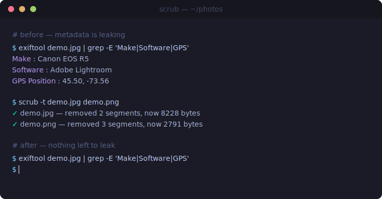

<div align="center">

<a href="https://github.com/effjy/scrub/"></a>

**Forensic-grade metadata scrubber for Linux.**

[](#)
[](#)
[](LICENSE)
[](#)
[](#supported-formats)
[](#)

<br>

`scrub` strips identifying metadata out of your files **before you share them** —
the defensive complement to a forensic extractor. It removes Exif/XMP/IPTC blocks
from images, drops textual and timestamp chunks, and can reset filesystem
timestamps. It parses the formats natively in C, so there are **no runtime
dependencies** — no libexif, no ImageMagick.

<br>



<sub><i>One command strips the camera make, editing software and GPS coordinates — the file still opens, but there's nothing left to leak.</i></sub>

</div>

---

## Supported formats

| Format | Stripped |
|:---|:---|
| **JPEG** | `APP1` (Exif/XMP), `APP2`–`APP15` (ICC/Photoshop/vendor), `APP13` (IPTC), `COM` comments |
| **PNG**  | `tEXt`, `zTXt`, `iTXt` (text), `tIME` (timestamp), `eXIf` (embedded Exif) |

Image pixels are never re-encoded — only metadata segments are removed, so the
image itself is byte-for-byte preserved.

## Build

```sh
make
sudo make install      # installs to /usr/local/bin
```

## Usage

```sh
scrub photo.jpg                  # scrub one file in place
scrub *.png                      # scrub many
scrub -t secret.jpg              # also reset atime/mtime to the epoch
```

```
✓ photo.jpg — removed 3 segments, now 184204 bytes
```

Options:

| Flag | Effect |
|:---|:---|
| `-t`, `--reset-times` | Reset file atime/mtime to the Unix epoch |
| `-h`, `--help` | Show help |
| `-V`, `--version` | Show version |

Scrubbing is done via a temp file and an atomic `rename(2)`, so an interrupted
run never corrupts the original. Original permissions are preserved.

## Roadmap

- [ ] PDF metadata (Info dictionary, XMP)
- [ ] Office / ODF document properties
- [ ] GTK3 drag-and-drop front-end
- [ ] Recursive directory mode

## License

MIT — see [LICENSE](LICENSE).
